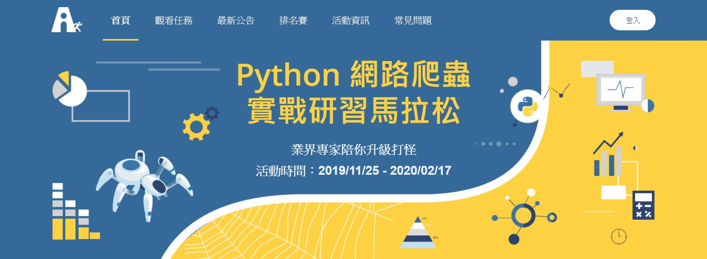

# Python-Web-Scraping-Marathon
<a href="https://pycrawler.cupoy.com/">2019 Python 網路爬蟲實戰研習馬拉松 Python Web Scraping Marathon</a>

## 1. 爬蟲基礎知識 Basc Knowledge of Web Scraping
<a href="https://github.com/tgnco1218/Python-Web-Scraping-Marathon/tree/master/homework/Day001_Source_of_Data_and_Read_Write_Files">001：資料來源與檔案存取 Source of Data and Read Write Files</a> 
<a href="https://github.com/tgnco1218/Python-Web-Scraping-Marathon/tree/master/homework/Day002_Download_and_Parse_CSV_with_Python">002：實作-Python下載CSV檔案與解析 Downloading and Parsing CSV files with Python</a> 
<a href="https://github.com/tgnco1218/Python-Web-Scraping-Marathon/tree/master/homework/Day003_Download_and_Parse_XML_with_Python">003：實作-Python下載XML檔案與解析 Downloading and Parsing XML files with Python</a> 
<a href="https://github.com/tgnco1218/Python-Web-Scraping-Marathon/tree/master/homework/Day004_HTTP_Server-Client_and_access_to_API_using_Python">004：HTTP網站架構與運作方式利用Python存取API  HTTP Server-Client and access to API using Python</a> 
<a href="https://github.com/tgnco1218/Python-Web-Scraping-Marathon/tree/master/homework/Day005_API_Concatenation-Fetching_and_Parsing_JSON_files">005：API資料串接-存取、解析一個JSON格式的API資源 API Concatenation - Fetching and Parsing JSON files</a> 

<a href="">006：API資料串接-在API存取中加上標頭檔 API Concatenation - Adding Headers while Fetching API</a> 

## 2. 靜態網頁爬蟲技術

007：HTTP 靜態網頁架構說明與淺談HTML / CSS / JavaScript
淺談 HTTP 網站架構與運作方式與 網頁基礎結構：HTML、CSS、JavaScript

008：靜態網頁的資料爬蟲策略
解析靜態網站的運算方式與爬蟲的實作策略

009：圖片下載
了解除了文字以外的圖片爬蟲技術

010：PyQuery/grab
介紹更多的資料爬蟲工具

011：Regular expression
學習利用正規表達式，過濾及擷取資料

012：實作 Day：ETTODAY 靜態爬蟲實作練習
以 ETTODAY 為例示範如何完成網頁爬蟲

013：實作 Day：PTT(批踢踢)網路爬蟲實作練習
以 PTT 為例示範如何完成網頁爬蟲

014：實作 Day：Yahoo! 電影網頁爬蟲實作練習
以YAHOO電影為例示範如何爬取電影資訊

015：實作 Day：金融資訊網頁爬蟲實作練習
以台銀網站為例示範如何爬取資訊並整理資料

016：實作 Day：Wiki的爬蟲實作練習
練習爬取Wikipedia的資料

## 3. 動態網頁爬蟲技術

017：HTTP 動態網頁架構說明與非同步取得資料
解析動態網站的運算方式與爬蟲的實作策略

018：瀏覽器開發者工具介紹
介紹瀏覽器開發工具

019：動態網頁爬蟲 - 使用Selenium + BeautifulSoup 模擬瀏覽器執行
示範如何使用瀏覽器模擬工具實作動態網頁爬蟲

020：動態網頁爬蟲 - 利用開發者工具，觀察模擬 API 存取
示範如何使用瀏覽器開發工具實作動態網頁爬蟲

021：實作 Day：ETTODAY 動態爬蟲實作練習
以 ETTODAY 為例示範如何完成網頁爬蟲

022：實作 Day：空氣污染網站爬蟲實作練習
以 空氣污染網站 為例示範如何完成網頁爬蟲

023：實作 Day：東森新聞雲網站爬蟲實作練習
以東森新聞為例示範如何完成網頁爬蟲

024：實作 Day：104人力銀行網站爬蟲實作練習
以104人力銀行網站為例示範如何完成網頁爬蟲

## 4. Scrapy 網站爬蟲框架

025：多網頁爬蟲實作策略介紹
大量爬蟲的起點: 多網頁 / 多網站爬蟲策略

026：Scrapy 爬蟲流程 (1) - 建立流程 + 送出請求
Scrapy 爬蟲框架初探 (1): 建立專案與請求

027：Scrapy 爬蟲流程 (2) - XPath + Item Pipeline
Scrapy 爬蟲框架初探 (2): 處理資料的 pipeline

028：Scrapy 爬蟲流程 (3) - API
Scrapy 爬蟲框架初探 (3): 由外部呼叫框架爬蟲

029：Scrapy 爬蟲流程 (4) - 多網頁爬蟲
Scrapt 爬蟲框架初探 (4): 以 PTT 為例實作框架多網頁爬蟲

## 5. 進階爬蟲技術

030：爬蟲可能會遇到的問題

031：反爬：瀏覽器標頭與基本資訊

032：反爬：驗證碼處理

033：反爬：登入授權模擬

034：反爬：代理 IP

035：加速：多線程爬蟲

036：加速：非同步爬蟲

037：自動化更新機制(排程)

## 6. 期末實戰專題

038：期末專題

039：期末專題

040：期末專題
